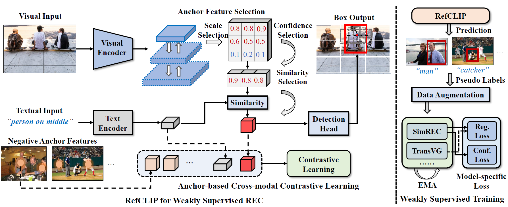

# RefCLIP++
[](https://www.python.org/)


This is the official implementation of "RefCLIP++: A Collaborative Teacher  for  Weakly Supervised Referring Expression Comprehension".


<p align="center">
	<!--  -->
  
</p>

## Installation
- Clone this repo
```bash
git clone https://github.com/kingthreestones/RefCLIP-plus.git
cd RefCLIP-plus
```

- Create a conda virtual environment and activate it
```bash
conda create -n refclip++ python=3.8 -y
conda activate refclip++
```
- Install Pytorch following the [official installation instructions](https://pytorch.org/get-started/locally/)
- Install apex  following the [official installation guide](https://github.com/NVIDIA/apex)
- Compile the DCN layer:

```bash
cd utils_refclip/DCN
./make.sh
```

```bash
pip install -r requirements.txt
wget https://github.com/explosion/spacy-models/releases/download/en_vectors_web_lg-2.1.0/en_vectors_web_lg-2.1.0.tar.gz -O en_vectors_web_lg-2.1.0.tar.gz
pip install en_vectors_web_lg-2.1.0.tar.gz
```

## Data Preparation

- Download images and Generate annotations according to [SimREC](https://github.com/luogen1996/SimREC/blob/main/DATA_PRE_README.md).

- Download the pretrained weights of YoloV5 from [OneDrive](https://1drv.ms/u/c/e41016e77138b546/EURIW6LMAJJOuNy5Bi_H34wBjUMCYijpv2faLthSdrZ2dw?e=FZhmeQ).

- Download the pretrained weights of CSPDarkNet from [OneDrive](https://1drv.ms/u/c/e41016e77138b546/ETCOQFZjjoJFvoH73hDqd_oBsG3W_d7GpMI7_IzVZ77hMg?e=6y0ZN8).


The project structure should look like the following:

```
| -- RefCLIP-plus
     | -- data_rec
        | -- anns
            | -- refcoco.json
            | -- refcoco+.json
            | -- refcocog.json
        | -- images
            | -- train2014
                | -- COCO_train2014_000000000072.jpg
                | -- ...
        | -- masks
            | -- refcoco
            | -- refcoco+
            | -- refcocog
     | -- config
     | -- datasets
     | -- models_refclip
     | -- utils_refclip
```
- NOTE: our YoloV5 is trained on COCO’s training images, 
excluding those in RefCOCO, RefCOCO+, and RefCOCOg’s validation+testing. 


## RefCLIP++

### Training
```
python train.py --config ./config/[DATASET_NAME].yaml --config2 ./config/simrec.yaml
```

### Evaluation
```
python test.py --config ./config/[DATASET_NAME].yaml --config2 ./config/simrec.yaml --eval-weights [PATH_TO_CHECKPOINT_FILE] --eval-weights2 [PATH_TO_SIMREC_CHECKPOINT_FILE]
```

